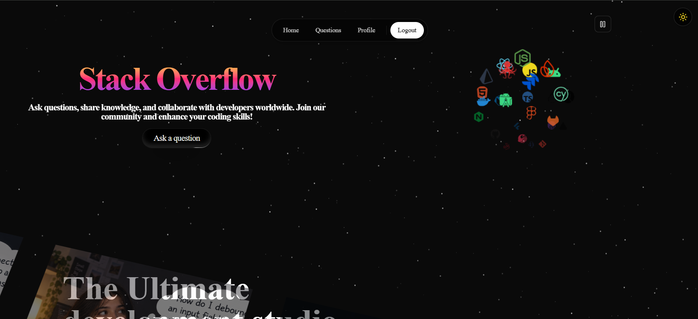
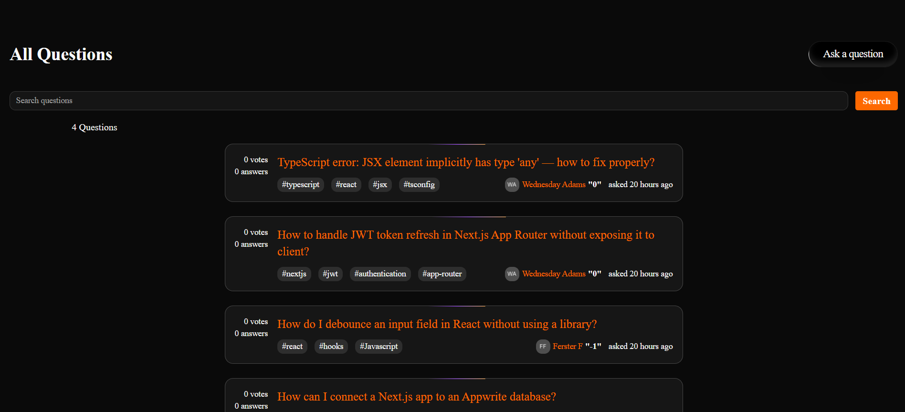
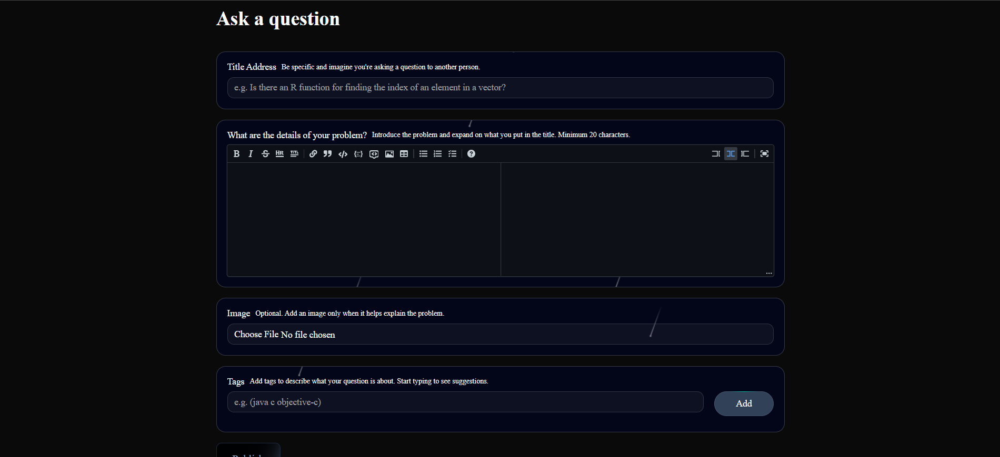
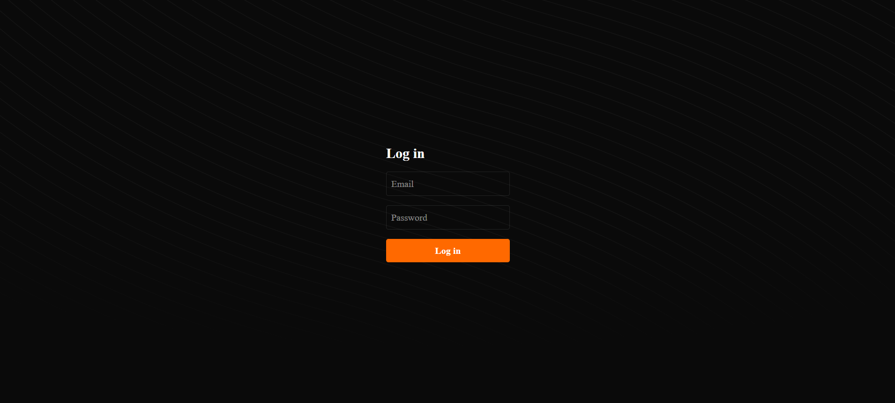

# Rever Flow 🚀

<p align="center">
  
</p>

<p align="center">
  A modern, full-stack Q&A platform inspired by Stack Overflow, built with <strong>Next.js</strong>, <strong>TypeScript</strong>, and <strong>Appwrite</strong>.
</p>

<p align="center">
  
  
  
  
</p>

---

## ✨ About The Project

This project is a full-stack **Rever Flow Q&A platform** where developers can:

* ❓ Ask programming questions
* 💬 Share answers and comments
* 👍 Upvote and downvote content
* 🏷️ Organize questions using tags
* 🔎 Search for questions
* 🖼️ Upload image attachments
* 🌙 Use the application in dark mode

> Built as a learning and portfolio project to explore modern full-stack development with Next.js and Appwrite.

---

## 🚀 Features

<table>
<tr>
<td>🔐 <strong>Authentication</strong></td>
<td>❓ <strong>Questions</strong></td>
<td>💬 <strong>Answers</strong></td>
</tr>
<tr>
<td>User registration, login & sessions</td>
<td>Create, browse & search questions</td>
<td>Answer existing questions</td>
</tr>
<tr>
<td>🏷️ <strong>Tags</strong></td>
<td>👍 <strong>Voting</strong></td>
<td>💭 <strong>Comments</strong></td>
</tr>
<tr>
<td>Categorize programming questions</td>
<td>Upvote & downvote content</td>
<td>Comment on questions & answers</td>
</tr>
<tr>
<td>🔎 <strong>Search</strong></td>
<td>🖼️ <strong>Attachments</strong></td>
<td>🌙 <strong>Dark Mode</strong></td>
</tr>
<tr>
<td>Search questions by content</td>
<td>Upload images with questions</td>
<td>Responsive dark theme</td>
</tr>
</table>

---

## 🛠️ Tech Stack

| Technology             | Purpose                                    |
| ---------------------- | ------------------------------------------ |
| ⚡ **Next.js**          | React framework & application architecture |
| 🔷 **TypeScript**      | Type-safe development                      |
| ⚛️ **React**           | UI development                             |
| ☁️ **Appwrite**        | Authentication, database & storage         |
| 🎨 **Tailwind CSS**    | Styling & responsive design                |
| 🧩 **shadcn/ui**       | Reusable UI components                     |
| 🐻 **Zustand**         | State management                           |
| ✨ **Motion**           | Animations                                 |
| 📝 **React MD Editor** | Markdown editing                           |
| 🔗 **Lucide**          | Icons                                      |

---

## 📸 Screenshots

### 🏠 Home Page

<p align="center">
  
</p>

### ❓ Question Page

<p align="center">
  
</p>

### ✍️ Ask Question

<p align="center">
  
</p>

### 🔐 Authentication

<p align="center">
  
</p>

---

## 📂 Project Structure

```text
rever-flow/
│
├── public/
│   └── screenshots/
│       ├── home.png
│       ├── question.png
│       ├── ask-question.png
│       ├── login.png
│       └── demo.gif
│
├── src/
│   ├── app/
│   ├── components/
│   ├── lib/
│   ├── actions/
│   └── ...
│
├── .gitignore
├── components.json
├── next.config.ts
├── package.json
├── postcss.config.mjs
├── tsconfig.json
├── PRD.md
└── README.md
```

---

## ⚙️ Getting Started

### 1. Clone the repository

```bash
git clone https://github.com/ranichandnirani/rever-flow.git
```

### 2. Navigate to the project

```bash
cd rever-flow
```

### 3. Install dependencies

```bash
npm install
```

### 4. Configure Appwrite

Create an Appwrite project and configure authentication, database, collections, storage, permissions, and indexes.

Create a `.env.local` file:

```env
NEXT_PUBLIC_APPWRITE_ENDPOINT=your_appwrite_endpoint
NEXT_PUBLIC_APPWRITE_PROJECT_ID=your_project_id
NEXT_PUBLIC_APPWRITE_DATABASE_ID=your_database_id
NEXT_PUBLIC_APPWRITE_BUCKET_ID=your_bucket_id
APPWRITE_API_KEY=your_appwrite_api_key
```

> ⚠️ Never commit real API keys or sensitive environment variables.

### 5. Run the development server

```bash
npm run dev
```

Open:

```text
http://localhost:3000
```

---

## 🗄️ Appwrite Data Model

### Questions

```text
questions
├── title
├── content
├── authorId
├── tags
└── attachmentId
```

### Answers

```text
answers
├── content
├── authorId
└── questionId
```

### Comments

```text
comments
├── content
├── authorId
├── type
└── typeId
```

### Votes

```text
votes
├── userId
├── type
├── typeId
└── value
```

---

## 🔄 How It Works

```text
        👤 Register / Login
                ↓
        🏠 Browse Questions
                ↓
          🔎 Search / Filter
                ↓
          ❓ Open Question
                ↓
          💬 Read Answers
                ↓
       ✍️ Answer / Comment
                ↓
          👍 Vote Content
                ↓
       ❓ Ask Your Question
```

---

## 🎯 What I Learned

Building this project helped me understand:

* Next.js App Router
* TypeScript in a real-world application
* Appwrite authentication
* Database design & relationships
* CRUD operations
* File uploads & storage
* Authentication & authorization
* Search & pagination
* State management with Zustand
* Responsive UI development
* Reusable React components

---

## 🚀 Future Improvements

* 🔔 Real-time notifications
* 🏆 Reputation & badge system
* 🚩 Question/answer reporting
* 🛡️ Admin moderation dashboard
* 📧 Email notifications
* 👤 Advanced user profiles
* 🔖 Bookmark questions
* 🌐 Multi-language support

---

## 👩‍💻 Author

<p align="center">
  <strong>Chandni Rani</strong>
  <br/>
  Aspiring Full Stack Web Developer
</p>

<p align="center">
  <a href="https://github.com/ranichandnirani">
    
  </a>
  <a href="https://www.linkedin.com/in/chandnirani/">
    
  </a>
</p>

---

## ⭐ Support

If you found this project interesting, consider giving the repository a ⭐.

<p align="center">
  <strong>Code. Learn. Build. Repeat. 🚀</strong>
</p>
